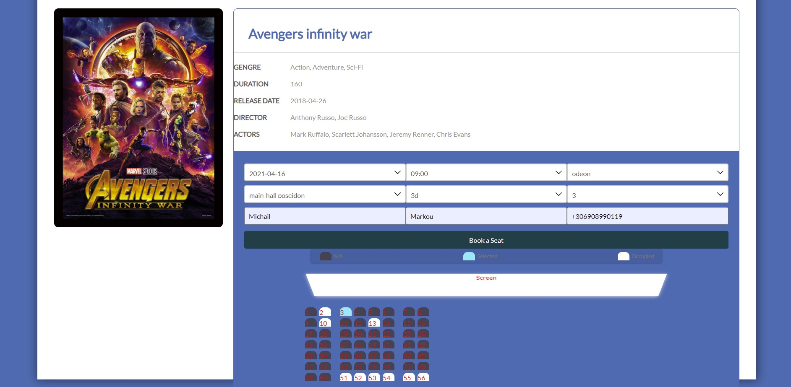
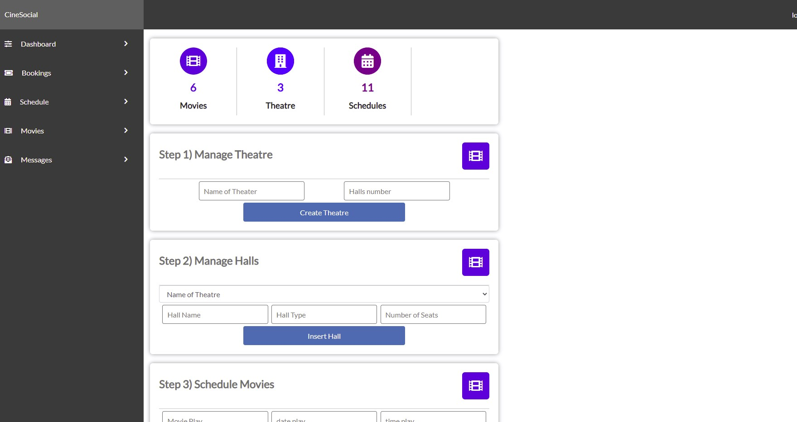

Professional Cinema Booking System Dynamic Handle From Admin Portal Page UI - Relational Database Constraints MYSQL - Object Oriented PHP Core - AngularJS MVC - Minimal Vial Product

YouTube ScreenCast of the Application:

